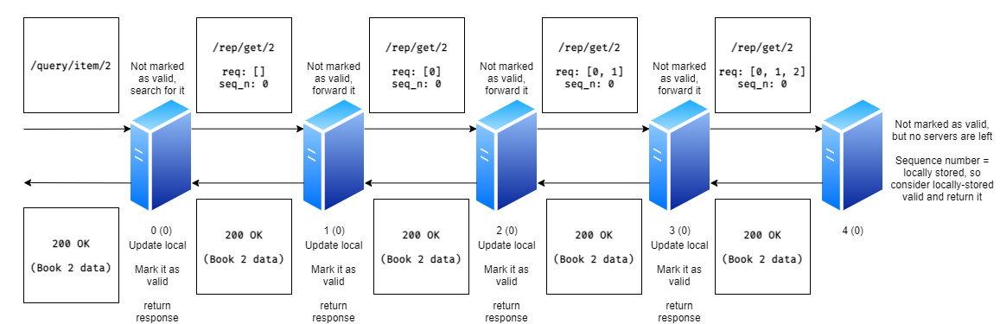
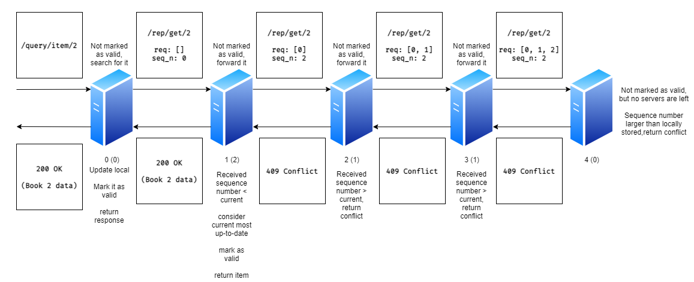
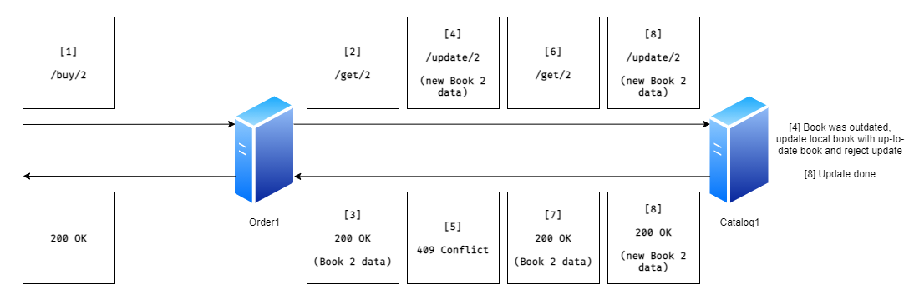
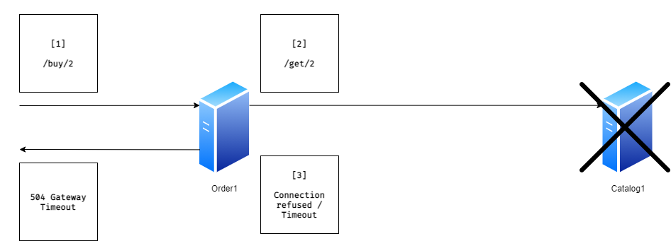
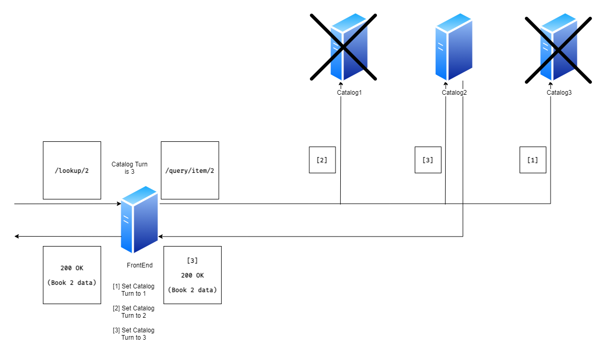
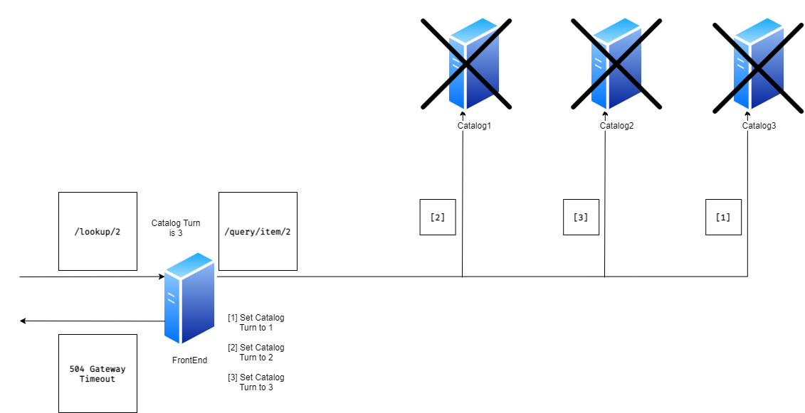

# Bazar V2

Make sure to have read [Bazar V1 documentation](https://github.com/omarhurani/Bazar/blob/V1/README.md) prior to reading this.

---

## Caching

Caching was implemented in the front-end server using a Python dictionary (`dict`) and list (`list`). The dictionary is to store key-value pairs of the cache, and the list to act as a **Least Recently Used (LRU)** queue for the cache replace policy.

### Lookup Caching

Caching book lookups was simple. The key was the ID of the book and the value was the returned JSON object of that book. An end-point is introduced in order for catalog servers to invalidate the lookup cache. This end-point receives the book ID as a paramters and removes the cache entry with that ID if it exists in cache.

In the catalog server, when an update is performed on a book, it sends a request with the ID of that book to the invalidation end-point of the front-end server in order to remove it from its cache. This also implies that the catalog server needs to know the address of the front-end server, so it is added to the environment variables needed for it.

### Search Caching

Caching search results is a little bit more tricky, since changes to a book could invalidate a whole topic (however, in Bazar, updates done don't modify fields that are returned in search results, so invalidating is not nessecary, but I implemented it anyways). I approached this problem by using the search string as the key, and the entry being two things, the JSON response of the search operation, and a set of all topics included in that response. When the catalog server sends an invalidate request for a topic on its end-point in the front-end server, all cached items are checked for their topic set, and any topic set that includes that topic are removed from the cache. Another end-point was added that allows catalog servers to clear the cache completely. This is useful when a new book needs to be added in the future.

---

## Replication

### Catalog Servers

The first modification made to the catalog server was the needed environment variables, since it nows needs to know the addresses of the other catalog servers.

Environment Variable | Description | Example
-------------------- | ----------- | -------
`CATALOG_ADDRESSES` | The addresses of the other catalog servers. Addresses are seperated by a `\|` character | `http://catalog2.bazar.com\| http://catalog2.bazar.com`

Consistency issues rise in both read and write operations.

#### **Sequence Numbers**

In order for servers to keep track of the versions of the books they have, a sequence number field for each was introduced. This field is used to compare versions between servers in order to maintain consistency.

#### **Read**

If a catalog server goes down for some time and then goes back up, the data inside it might become outdated due to writes on other replicas that did not encounter outage.

In order to handle this issue, each server kept an in-memory list of all books that are validated to be consistent with other copies. This list starts out empty. Whenever a read request is received, the list is checked. If the ID of that book exists, it responds with the locally-stored book. If not, it selects a random catalog server and sends a request to it in order to retreive the up-to-date book. This request will keep hopping over between servers until either a server with the book marked as valid is found or no more servers are left.

If a server with the valid book was found, that server returns all the information about the book in the response, and its updated in all servers that requested it.

If no servers are left, the last server in the chain considers its version the correct version and returns its book in the response. This situation can only occur in 2 cases:

1. **Cold Start**: when Bazar is deployed for the first time, all catalog servers will have their valid list empty. In this case, the databases for all catalog servers are matching.

2. **Total Failure**: when all catalog servers fail at the same time and restart. Read requests will hop between catalog servers until they reach a dead-end, and end up selecting books with the highest sequence number to be used.

The following figures demonstrate how read requests flow between catalog servers.

*Note: Server numbers are displayed under the server. The number inside () is the sequence number for the sample object currently in that server. Bold server text means that that object is marked as valid in memory.*

##### **Cold Start Read**

##### **Read from an outdated server, with some servers having thier items marked as valid**

##### **Read after all catalog servers were down at the same time**

#### **Write**

Catalog servers need to make sure that any write persists on all replicas to maintain consistency. They also use the same updated list to make sure that their copy is consistent.

If their copy is not up-to-date, a different approach was used than the read approach. A catalog server will send a check request to all other catalog servers to check the sequence numbers of the objects they have. The servers respond with an OK message if the sequence number they receive is larger than or equal to their current one (indicating that a write can be performed), and a Conflict response if their current sequence number is larger than the one received in the check request, alongside with the object data. The original server. If all recevied responses were OK, the server can proceed with updating the value. If not, it updates its local value with the most up-to-date object (the object with max sequence number between all Conflict responses) and returns a Conflict response, telling its requester that the write could not be performed for them to retry. This is important because the order server calculates the new stock value when an order is performed, and has to be informed that the catalog server had outdated information in order for it to re-calculate the new stock and retry the write operation.

After that, if the catalog server is still proceeding with the write operation (has object marked as up-to-date or had a writable sequence number for all ohter instances), it proceeds to send a replication update message to all other catalog servers with the new information. It ignores downed servers.

The following figures demonstrate how write requests are handled.

*Note: Server numbers are displayed under the server. The number inside () is the sequence number for the sample object currently in that server. Bold server text means that that object is marked as valid in memory.*

##### **Write with all servers having same sequence number**

##### **Write on an outdated object**

### Order Servers

Each order server communicates with one catalog server. If it can't reach it, it returns a Gateway Timeout error. It functions mostly the same as V1. The only difference is that checks if the write response error code is a Conflict error, it fetches the book again and repeats the attempt to write the book with a quantity reduced by one.

If the order server cannot reach its catalog server (either in retreiving the book or when updating it), it returns a Gateway Timeout response.

The following figures demonstrate how order requests are handled.

##### **Normal flow**

##### **Book at catalog server is outdated**

*Note: In normal circumstances, this situation should not occur because the read operation will make sure that the object at the server is up-to-date, so the update request should have the most up-to-date object, but it was implemented just in case of any abnormal behavior in race conditions, etc...*

##### **Catalog server is unreachable**

### Front-end Server

Changes to the front-end server are more than the changes to the order servers, but still not major. First, the environment variables now support multiple catalog and order servers.

Environment Variable | Description | Example
-------------------- | ----------- | -------
`CATALOG_ADDRESSES` | The addresses of the catalog servers. Addresses are seperated by a `\|` character | `http://catalog1.bazar.com\| http://catalog2.bazar.com\| http://catalog3.bazar.com`
`ORDER_ADDRESSES` | The addresses of the order servers. Addresses are seperated by a `\|` character | `http://order1.bazar.com\| http://order2.bazar.com\| http://order3.bazar.com`

After they are imported, they are used in a round-robin fassion. The front-end server attempts to connect with the server with the current turn, and proceeds normally if successful. Otherwise, it tries the other servers one by one. If none can be reached, it returns a Gateway Timeout error response. It also handles Gateway Timeout responses from order servers (catalog server for that order server is down) the same way as a failed connection, and attempts to connect to a new order server.

The following figures demonstrate how replication is handled at the front-end side.

##### **Normal flow**

##### **Some servers are unreachable (same on order and catalog)**

##### **Some order servers can't reach their catalog server**

##### **All servers are unreachable (same on order and catalog)**

---

## Dockerization

For each server, a `Dockerfile` file is included in order to be able to create docker images for each server. It is set up to use the latest `alpine` image as a base, install `python` and `pip` on it, expose the needed ports and set the start-up command for each server.

Moreover, a [Windows batch file](./docker_init.bat) is included that sets up a user-defined Docker network, creates the images and runs them in 5 containers.

Finally, the folder [env-vars](./env-vars) contains the enviroment variables that are needed for each Docker container to run properly. These files are referenced in the batch file. If more containers are to be added, the appropriate envrionement variables need to be modified for the existing containers and added for the new ones.

---

## Metrics

### Bazar V1 vs Bazar V2

In this section, I will be comparing the overall system performance for both Bazar V1 running on 3 virtual machines and Bazar V2 running with 2 replicas of order and catalog servers on Docker containers running on WSL.

Bazar V2 is running with 2 replicas for catalog and order servers, a cache of size 3 for book entries and of size 10 for search queries.

#### **Look-ups, all valid IDs**
In this test, 200 look-up requests were sent to each front-end server. All IDs sent exist in the catalog server(s) **(1 - 7)**. Bazar V2 started with an empty cache. The 200 numbers are random, but are identical for both verisons. 

Average response times were as follows:

Bazar V1 | Bazar V2
--- | ---
10.62 ms | 4.55 ms

We can see that the cache had a **57.16%** improvement when it came to many valid read operations.

#### **Look-ups, some invalid IDs**
This test the same as before. However, some of the IDs sent don't exist in the catalog server(s) **(1 - 7) and (8 - 10)**. Bazar V2 started with an empty cache. The 200 numbers are random, but are identical for both versions. 

Average response times were as follows:

Bazar V1 | Bazar V2
--- | ---
11.97 ms | 76.73 ms

Here, the improvement decreased, since non-existent items are always requested from catalog servers. In fact, the improvement decreased to **35.44%**. It is still better with a cache than without one.

#### **Look-ups, some invalidations**

#### **Writes**
From the design of the system, writes are expected to behave worse than Bazar V1, due to the cache and replication consistency operations that add up extra time. All books were set to 200 books in stock, and 200 buy operations were performed on random books, which were identical for both versions.

Average response times were as follows:

Bazar V1 | Bazar V2
--- | ---
39.21 ms | 44.78 ms

As it can be seen, Bazar V2 has a performance hit of about **14.21%** when it comes to writes, due to messages exchanged between catalog servers to guarantee replication consistency and between them and the front-end server for cache consistency.

#### **Conclusion**
As it can be seen, Bazar V2 easily defeats Bazar V1 in terms of read speeds. However, it lacks behind when it comes to write speeds.

### Outage

In this section, I will see how Bazar V2 performs when an outage occurs. 

Since Bazar V2 supports replication, and some servers may go down, timeouts have to be define for communications between servers. Timeout values for servers are as follows

Server | Connection Establishment Timeout | Full Timeout | Notes
--- | --- | --- | ---
Front End | 200 ms | 2000 ms | Doubled for `/buy` operations
Order | 150 ms | 1500 ms | -
Catalog | 100 ms | 1000 ms | -

These timeout values will be the main determiner of the performace of Bazar V2 in outage situations. They have to be monitored and tuned in order to reduce timeout values as much as possible without running into pre-mature timeouts (where a server times out because it takes too long to do the operation, not because it is down).

Of course, if all servers of a specific type go down, Bazar V2 becomes unusable. Since the current deployed system has 2 replicas of order and catalog servers, there are mainly 3 tests to be performed:

1. Read requests when a catalog server is down
2. Write requests when a catalog server is down (order server for that catalog server is still up)
3. Write requests when an order server is down

Tests were performed using 50 identical random read and buy requests. Results were as follows:

-- | No outage | Order outage | Catalog outage 
--- | --- | --- | --- 
Read | 5.9 ms | No effect | 111.78 ms
Write | 45.85 ms | 447.58 ms | 288.29 ms

As expected, Bazar V2 receives a performance hit one some servers are down. As I said before, timeout values have to be fine tuned to reduce this hit as much as possible. Theoretically, this performance hit should decrease once the number of replicas starts to increase, since connections to down servers happen less frequently, especially in reads. Moreover, the server choice algorithm at the front-end side could be tuned to better adjust to down servers and mark failed requests and make less requests to the server which fails more.